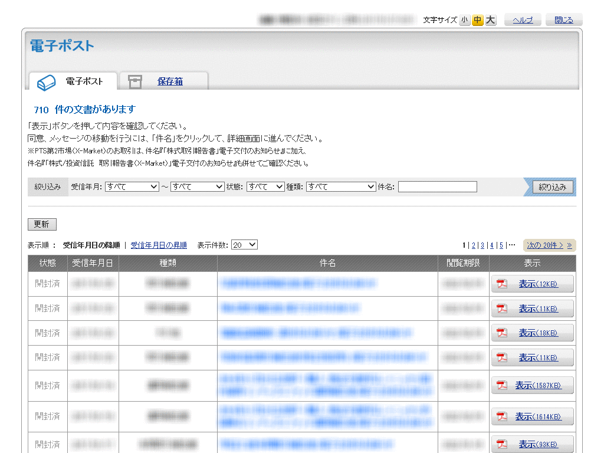

POSTUB PDF Downloader Bookmarklet
=================================

https://shingo45endo.github.io/postub_downloader/



This is a bookmarklet to download PDF files as a zip file for POSTUB system.

[POSTUB](https://www.nri-secure.co.jp/service/postub/index.html) is one of an electronic mailbox system for Japanese financial institutions. This system is used to send personal correspondences regarding trading reports. However, it doesn't have "bulk download" feature even though there are many reports which should be downloaded.

This bookmarklet can download all the PDF files on the current page as a zip file.

- - - - - - - - - - - - - - - -

POSTUB(電子信書交付サービス)からPDFファイルをまとめてzipファイルとしてダウンロードするブックマークレットです。

[POSTUB](https://www.nri-secure.co.jp/service/postub/index.html)は日本のいくつかの金融機関で使われている電子信書交付サービスで、取引や運用についての報告書を電子交付するために使われています。しかし、大量の報告書が交付されるにもかかわらず「まとめてダウンロード」のような機能がなく一つ一つダウンロードするしかないため非常に不便です。

このブックマークレットを使うことで、現在のページ上のすべてのPDFファイルをzipファイルとしてダウンロードできます。


Usage
-----

<a href="javascript:(function(){var a='https://shingo45endo.github.io/postub_downloader/postub_downloader.js?'+Date.now();var d=document;var e=d.createElement('script');e.charset='utf-8';e.src=a;d.getElementsByTagName('head')[0].appendChild(e);})();" style="padding: 0.5rem 1rem; border-radius: 0.25rem; background-color: rgba(0,128,255,0.125); font-size: 1.25rem;">POSTUB PDF Downloader Bookmarklet</a>

1. Bookmark the above link.
2. Move to POSTUB website.
3. Choose the bookmark on a POSTUB page which contains a list of PDF files.
4. All the PDF files on the current page will be downloaded and archived as a zip file automatically.
	* If your browser doesn't support bookmarklets (ex. Microsoft Edge), after entering Developer Mode by hitting <kbd>F12</kbd>, input the following code snippet on Console tab.

```javascript
(function(){var a='https://shingo45endo.github.io/postub_downloader/postub_downloader.js?'+Date.now();var d=document;var e=d.createElement('script');e.charset='utf-8';e.src=a;d.getElementsByTagName('head')[0].appendChild(e);})();
```

- - - - - - - - - - - - - - - -

1. 上のリンクをブックマークに登録します。
2. POSTUBのサイトに移動します。
3. PDFのリストが表示されているページ上で、登録したブックマークを選択します。
4. 現在のページ上のすべてのPDFファイルが自動的にダウンロードされ、zipファイルにアーカイブされます。
	* ブラウザがブックマークレットをサポートしていない場合、<kbd>F12</kbd>を押して開発者モードに移動し、コンソールタブで上記のコードスニペットを入力してください。


License
-------

MIT


Author
------

[shingo45endo](https://github.com/shingo45endo)
